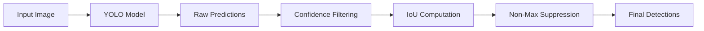
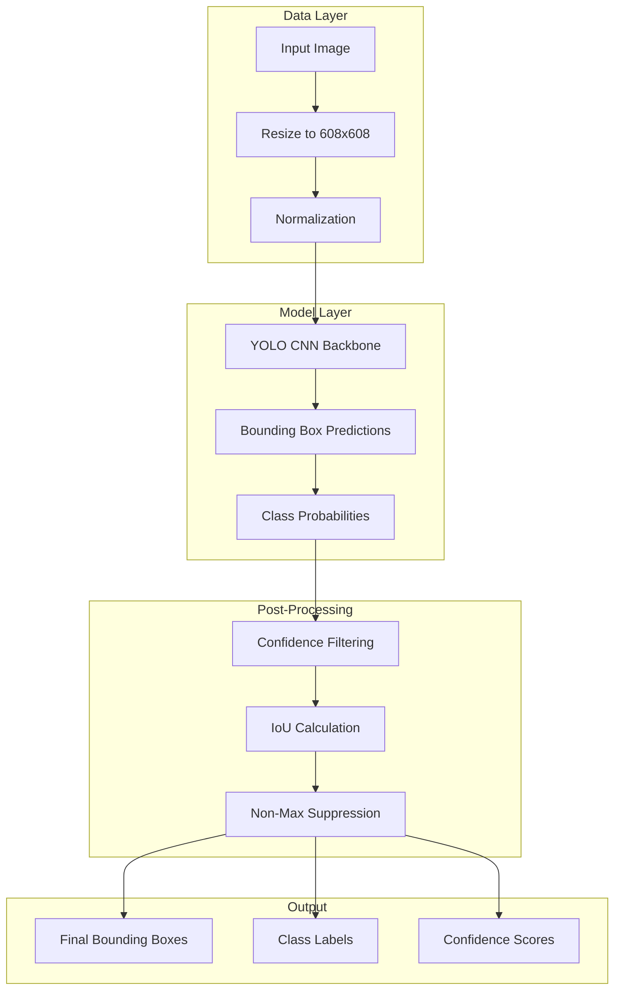

# YOLO Object Detection with TensorFlow/Keras

A computer vision project that implements the YOLO (You Only Look Once) object detection pipeline using TensorFlow and Keras. The system performs real-time object detection by combining a pretrained YOLO model with custom post-processing steps such as confidence filtering, IoU computation, and Non-Max Suppression.

---

## Overview

This repository demonstrates how single-stage object detectors like YOLO perform detection in a unified pipeline. It focuses on understanding the internal mechanics of bounding box prediction, filtering, and post-processing required for accurate object localization.

---

## Features

- End-to-end YOLO object detection pipeline  
- Bounding box filtering using objectness and class probabilities  
- Intersection over Union (IoU) computation  
- Non-Maximum Suppression (NMS) for duplicate removal  
- Inference on real-world images  
- Modular and educational implementation  

---

## Model & Framework

- **Model**: YOLO (v2-style)  
- **Framework**: TensorFlow 1.x with Keras backend  
- **Task**: Real-time object detection  
- **Input Shape**: 608 × 608 × 3  
- **Output**: Bounding boxes, class labels, confidence scores  

---

## System Architecture

### High-Level Pipeline

## Modular System Design

## Core Components

- `yolo_filter_boxes`  
  Filters predicted boxes based on confidence and class probabilities  

- `iou`  
  Computes Intersection over Union between bounding boxes  

- `yolo_non_max_suppression`  
  Removes overlapping bounding boxes using Non-Max Suppression  

- `yolo_eval`  
  End-to-end YOLO post-processing pipeline  

- `predict`  
  Runs inference and saves output images  

---

## Dataset & Classes

- **Dataset**: COCO (pretrained)  
- Class labels loaded from `coco_classes.txt`  
- Anchor boxes loaded from `yolo_anchors.txt`  

---

## Processing Pipeline

1. Load input image  
2. Resize to 608 × 608  
3. Pass through YOLO model  
4. Extract bounding boxes and class scores  
5. Apply confidence threshold filtering  
6. Compute IoU between boxes  
7. Apply Non-Max Suppression  
8. Output final detections  

---

## Evaluation & Testing

- Unit tests for:
  - IoU computation  
  - Bounding box filtering  
  - Non-Max Suppression  

- Tested on:
  - Overlapping boxes  
  - Non-overlapping boxes  
  - Edge cases  

- Session-based execution using `tf.Session()`  

---

## Results & Outputs

- Final bounding boxes on images  
- Class labels and confidence scores  
- Annotated output images  
- Console-based predictions  

